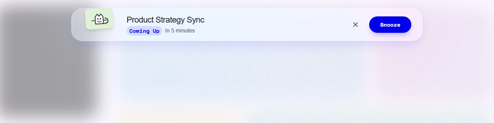
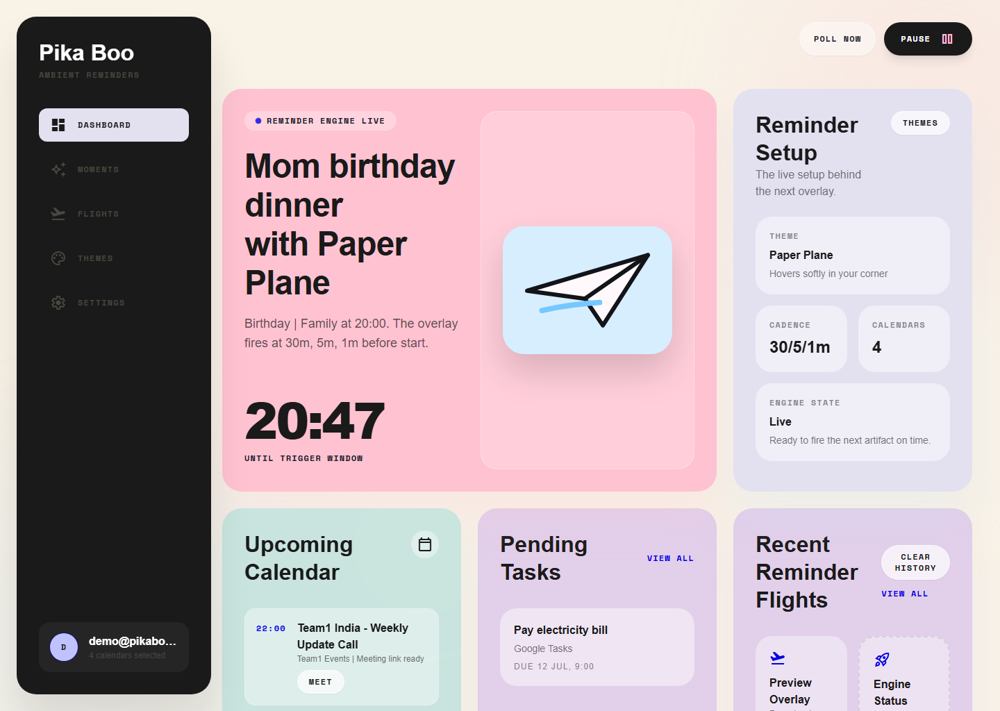
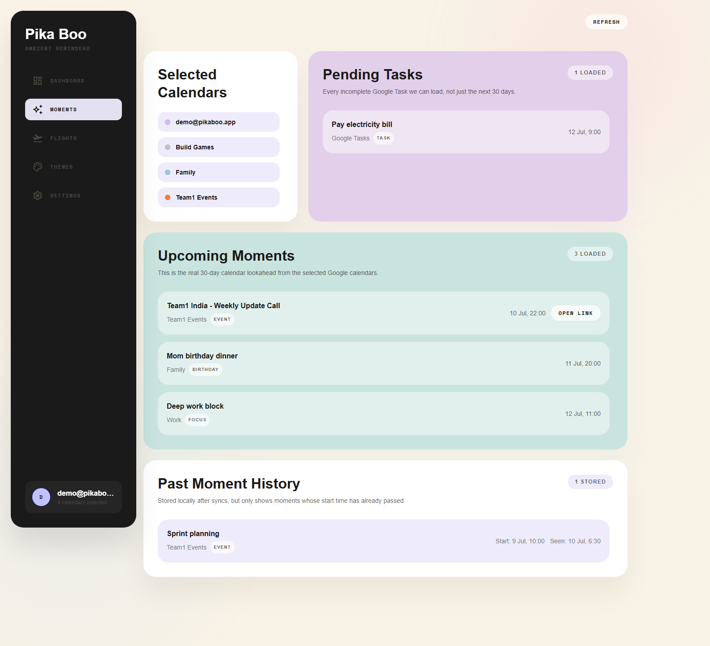
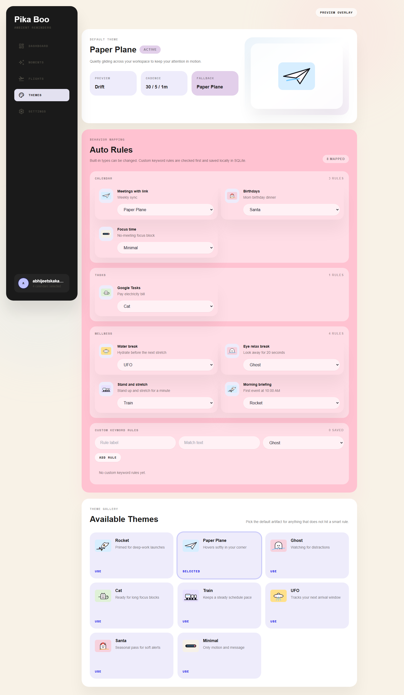
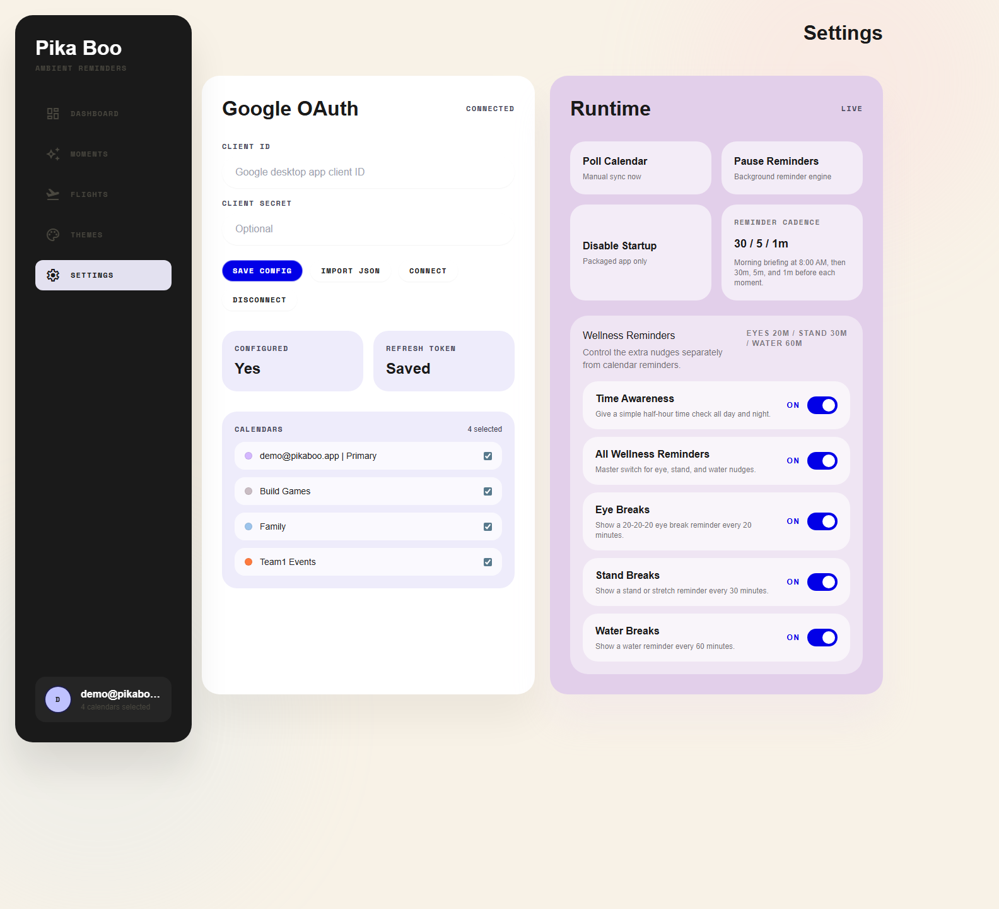

# Pika-Boo

Pika-Boo is a Windows desktop reminder app that makes calendar events hard to miss.

Instead of standard notifications, it shows a moving banner across the top of the screen so your eyes catch the motion while you work.

## Product Walkthrough

### Live Reminder Overlay

This is the core product moment: a reminder cuts across the top of the screen so you notice motion instead of ignoring another silent notification.



### Dashboard

The dashboard is the control tower. It shows the next reminder window, upcoming calendar items, pending tasks, and recent reminder deliveries in one place.



### Moments

Moments is the calendar-focused view. It shows the selected calendars and the real upcoming events/tasks that the reminder engine is watching.



### Themes

Themes controls how reminders look. You can set the default artifact, map event types like meetings or birthdays to specific visuals, and tune the app's personality without changing the reminder engine.



### Settings

Settings is where Google Calendar connection, startup behavior, polling, and wellness/time-awareness toggles live.



Settings screenshots use sanitized mock data so no live OAuth keys or private config are exposed.

## MVP

- Google sign-in
- Google Calendar read access
- Runs on Windows startup
- Background polling every 60 seconds
- Exact local reminder scheduling after each poll
- Animated artifact reminder across the top of the screen
- Auto hide after 8 seconds

## Docs First

Read these before building:

1. [PROMPT.md](/D:/Pika-Boo/PROMPT.md)
2. [PROJECT.md](/D:/Pika-Boo/PROJECT.md)
3. [REQUIREMENTS.md](/D:/Pika-Boo/REQUIREMENTS.md)
4. [ARCHITECTURE.md](/D:/Pika-Boo/ARCHITECTURE.md)
5. [TASKS.md](/D:/Pika-Boo/TASKS.md)

## Planned Stack

- Electron
- React
- TypeScript
- Tailwind CSS
- Google Calendar API
- CSS animations first, heavier animation tooling only if needed

## Scripts

- `npm run dev`
- `npm run build`
- `npm run smoke`
- `npm run package:dir`
- `npm run package:smoke`
- `npm run package:installer`
- `npm run package:installer:smoke`

`npm run smoke` now launches the built Electron app in a smoke-test mode and fails on renderer load errors.
`npm run package:smoke` builds `release/win-unpacked` and smoke-launches the packaged exe.
`npm run package:installer:smoke` builds the NSIS installer and asserts the installer exe is emitted.

## Current State

- Desktop shell is built
- Overlay reminder is wired
- Artifact-based overlay system is wired
- Built-in artifact selector is wired with ghost, rocket, train, UFO, cat, paper plane, santa, and minimal variants
- Artifact picker now shows inline previews before you trigger the overlay demo
- Control panel now uses the imported neo-brutal template screens instead of the earlier scaffold UI
- Renderer is split into `src/app`, `src/features`, and `src/shared` for newcomer-friendly navigation
- Google OAuth flow is wired
- Calendar polling and startup toggles are wired
- Calendar selection is wired for the connected Google account
- Polling now stages reminders locally so they can fire on the exact lead-time boundary instead of the next minute tick
- Reminder lead time is configurable from the control panel
- Reminder lead time is also adjustable from the tray menu
- Reminder artifacts can open meeting links directly
- Artifact visuals and the app logo now ship locally instead of using remote preview URLs
- Control panel shows the remaining live-verification and installer proof gaps
- Windows startup is only supported in a packaged app, not the dev shell
- Unpacked Windows packaging is wired and smoke-verified
- NSIS installer build is wired with installer-artifact smoke verification
- Live end-to-end verification still needs a real Google desktop OAuth client

## Google Setup

Create a Google OAuth desktop client and either import its JSON file in the app or paste the client ID manually before connecting Calendar.

## Repo Shape

```text
Pika-Boo/
|-- README.md
|-- PROMPT.md
|-- GOAL.md
|-- PROJECT.md
|-- REQUIREMENTS.md
|-- ARCHITECTURE.md
|-- UI_UX.md
|-- FEATURES.md
|-- ROADMAP.md
|-- API.md
|-- TECH_STACK.md
|-- CODING_GUIDELINES.md
|-- TASKS.md
|-- CHANGELOG.md
`-- docs/
    |-- flows.md
    |-- animations.md
    |-- notifications.md
    `-- google-auth.md
```

## Renderer Shape

```text
src/
|-- app/
|   |-- App.tsx
|   `-- useDesktopControlState.ts
|-- features/
|   |-- control-panel/
|   |   |-- components/
|   |   `-- pages/
|   `-- overlay/
|-- shared/
|   |-- data/
|   |-- ui/
|   `-- contracts.ts
|-- env.d.ts
|-- index.css
`-- main.tsx
```
